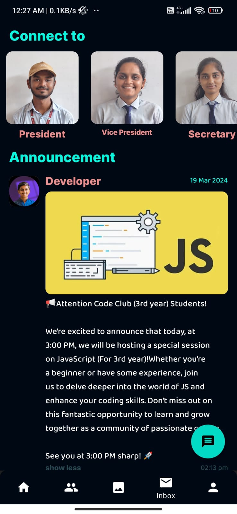

# Coding Crafter's Application

This native Android application serves as a dynamic platform for fostering engaging discussions among club members and soliciting valuable feedback for upcoming events. It empowers students by facilitating the exchange of thoughts and ideas, which in turn fuels innovation in project development.

## Inaugrated by college management

[👉🏻 Figma Prototype](https://lnkd.in/gBCWEchX)

[👉🏻 Figma Design](https://www.figma.com/file/tUhDIMuZXwQflFZeUBunrj/Code-Club-APP?type=design&node-id=0%3A1&mode=design&t=k0zKieJSHMTMGSVm-1)

[👉🏻 Download APK](https://firebasestorage.googleapis.com/v0/b/codingcrafters-fac21.appspot.com/o/raw%2FCodingCrafters.apk?alt=media&token=317f7d7d-ec2f-4661-abd3-a834b415681e)

#### Project Screenshots

<table>

  <tr>
   <td></td>
      <td></td>
   <td></td>
  </tr>

  <tr>
   <td></td>
    

   <td></td>
   <td></td>
  </tr>

</table>

## 
 

## Features
* **Seamless User Experience :** Effortlessly navigate through the application with a user-friendly login and signup feature.
* **Stay Informed :**  Stay updated on upcoming events, ensuring you never miss an exciting club activity.
* **Community Directory :**  Access a comprehensive list of all community members' profiles, fostering connections and collaboration.
* **Announcements Hub :**  Receive timely announcements about club events and other important updates directly, ensuring you're always in the loop.
* **Account Management :**   Easily manage your personal profile and account settings to customize your experience.
* **Realtime Notification.**
* **Realtime Chat :** Any logged in user can chat with individual designeted person.
* **Event Registration Form :** Admin can add Google form url to integrate google form in this app.
#### **Upcoming Features**
* **Payment Integration :**  Useful for collecting event fees and other payments through a single platform .

* **App Gallary :**  Android applications developed by the students are deployed here, making them easily available to everyone.

## Technologies Used 

- **Language: Java , XML** 
- **Database : Firebase Realtime , Firebase Storage, Firebase Authentication , FCM**
- **Additional Libraries :  [Glide image Loader](https://https://github.com/bumptech/glide) ,[Denzcoskun image Slider](https://github.com/denzcoskun/ImageSlideshow)**

## Application DFD

.png?alt=media&token=c2e13053-e1d5-4580-b7f5-721b8af56acc)
## Developers and Designers

 🧑‍💻 [Sameer Shaikh](https://github.com/Sameer377)
