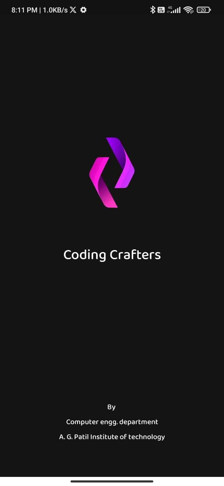

# Coding Crafter's Application

This native Android application serves as a dynamic platform for fostering engaging discussions among club members and soliciting valuable feedback for upcoming events. It empowers students by facilitating the exchange of thoughts and ideas, which in turn fuels innovation in project development.

[👉🏻 Download APK](https://firebasestorage.googleapis.com/v0/b/codingcrafters-fac21.appspot.com/o/dash%2Fapp-release.apk?alt=media&token=fac46048-6bb3-4745-bf5b-91e741ab1217)

#### Project Screenshots

<table>

  <tr>
   <td></td>
     <td></td>
   <td></td>
  </tr>

  <tr>
   <td></td>
     <td></td>
   <td></td>
  </tr>

</table>

## 
 

## Features
* **Seamless User Experience :** Effortlessly navigate through the application with a user-friendly login and signup feature.
* **Stay Informed :**  Stay updated on upcoming events, ensuring you never miss an exciting club activity.
* **Community Directory :**  Access a comprehensive list of all community members' profiles, fostering connections and collaboration.
* **Announcements Hub :**  Receive timely announcements about club events and other important updates directly, ensuring you're always in the loop.
* **Account Management :**   Easily manage your personal profile and account settings to customize your experience.
## Technologies Used 

- **Language: Java** 
- **Database : Firebase Realtime , Firebase Storage, Firebase Authentication , FCM**
- **Additional Libraries :  [Glide image Loader](https://https://github.com/bumptech/glide) ,[Denzcoskun image Slider](https://github.com/denzcoskun/ImageSlideshow)**

## Application DFD

.png?alt=media&token=c2e13053-e1d5-4580-b7f5-721b8af56acc)
## Developers and Designers

 🧑‍💻 [Sameer Shaikh](https://github.com/Sameer377)
